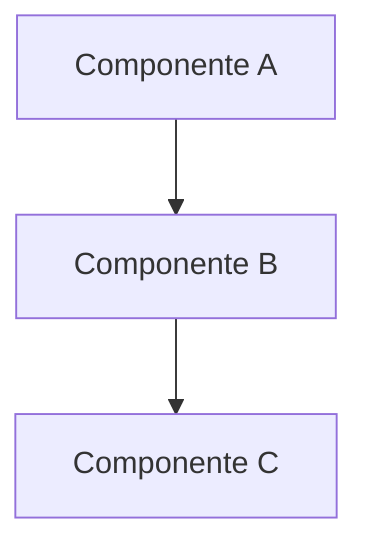

# 🎨 Como Visualizar a Arquitetura

## 🚀 Método Mais Rápido (RECOMENDADO)

### Opção 1: Abrir HTML no Navegador ⚡

```bash
# No terminal
cd docs
python -m http.server 8000

# Depois abra no navegador:
# http://localhost:8000/arquitetura_visual.html
```

Ou simplesmente:
```bash
# Linux
xdg-open docs/arquitetura_visual.html

# Mac
open docs/arquitetura_visual.html

# Windows
start docs/arquitetura_visual.html
```

**Você verá:**
- ✅ Diagrama completo e interativo
- ✅ Cores estilo AWS
- ✅ Legendas e explicações
- ✅ Estatísticas do sistema
- ✅ Botão para imprimir/salvar como PDF

---

## 📱 Método Online (SEM INSTALAÇÃO)

### Opção 2: Mermaid Live Editor

1. **Acesse:** https://mermaid.live

2. **Cole o código** de `docs/arquitetura.mermaid`

3. **Veja renderização** automática em tempo real

4. **Exporte:**
   - Clique em "Actions" → "Download PNG"
   - Ou "Download SVG" para qualidade vetorial
   - Ou "Copy Image" para colar diretamente

**Tempo:** 1 minuto ⏱️

---

## 🖼️ Método Python (Gera PNG)

### Opção 3: Gerar Imagem Automaticamente

```bash
# Instalar biblioteca
pip install diagrams

# Gerar diagrama
python docs/generate_architecture_diagram.py
```

**Resultado:** `docs/arquitetura_aws.png`

---

## 🎬 Para Apresentação em Vídeo

### Recomendação:

**Use a versão HTML (`arquitetura_visual.html`)**

**Por quê?**
- ✅ Visual profissional
- ✅ Cores estilo AWS
- ✅ Animações suaves
- ✅ Pode dar zoom
- ✅ Estatísticas visíveis
- ✅ Legendas claras

**Como usar na apresentação:**

1. Abra no navegador (F11 para tela cheia)
2. Use zoom do navegador para destacar partes (Ctrl/Cmd + +/-)
3. Pode imprimir para PDF se precisar

---

## 💾 Salvar como PDF

### Do HTML:

```bash
# 1. Abra arquitetura_visual.html no navegador
# 2. Pressione Ctrl+P (Cmd+P no Mac)
# 3. Selecione "Salvar como PDF"
# 4. Clique em "Salvar"
```

### Do Mermaid Live:

1. Renderize o diagrama
2. "Actions" → "Export" → "PDF"

---

## 🎨 Editar Diagrama

### Para modificar o diagrama:

**Arquivo:** `docs/arquitetura.mermaid`

**Sintaxe básica:**


**Cores:**
```mermaid
style A fill:#FF9900,stroke:#232F3E
```

**Teste suas mudanças em:** https://mermaid.live

---

## 📊 Comparação de Métodos

| Método | Tempo | Qualidade | Facilidade |
|--------|-------|-----------|------------|
| HTML no navegador | 30s | ⭐⭐⭐⭐⭐ | ⭐⭐⭐⭐⭐ |
| Mermaid Live | 1min | ⭐⭐⭐⭐⭐ | ⭐⭐⭐⭐⭐ |
| Python (diagrams) | 2min | ⭐⭐⭐⭐ | ⭐⭐⭐ |
| Draw.io manual | 15min | ⭐⭐⭐⭐⭐ | ⭐⭐ |

---

## 🎯 Checklist para Apresentação

- [ ] Arquitetura aberta e visível
- [ ] Diagrama em tela cheia (F11)
- [ ] Zoom preparado para detalhes
- [ ] Legendas visíveis
- [ ] Estatísticas destacadas
- [ ] Cores AWS reconhecíveis

---

## 💡 Dicas

### Para Vídeo:
- Use tela cheia (F11)
- Zoom in nos componentes importantes
- Aponte com cursor as integrações
- Fale sobre o fluxo de dados

### Para Slides:
- Exporte como PNG de alta resolução
- Use fundo branco para contraste
- Adicione títulos e notas

### Para Documento:
- Exporte como PDF
- Adicione página de capa
- Inclua legenda de cores

---

## 🆘 Problemas Comuns

### Diagrama não renderiza no HTML:

**Solução:** Verifique conexão com internet (usa CDN do Mermaid)

### Cores não aparecem:

**Solução:** Use Chrome ou Firefox (Safari pode ter problemas)

### Imagem muito pequena:

**Solução:** Use zoom do navegador ou exporte em resolução maior

### Fonte muito pequena para ler:

**Solução:** Ajuste fontsize no arquivo .mermaid

---

## 📞 Suporte

Se nenhum método funcionar, use o diagrama em ASCII da documentação (`docs/arquitetura.md`) - ele é claro e profissional! ✨

---

## 🎉 Recomendação Final

**Para sua apresentação, use:**

1. **Opção 1:** Abra `arquitetura_visual.html` no Chrome
2. Pressione F11 para tela cheia
3. Durante apresentação, navegue pelo diagrama
4. Destaque componentes com cursor
5. Mencione estatísticas (9 componentes, 18+ endpoints, etc.)

**Tempo de preparação:** 30 segundos ⚡

**Impacto visual:** 100% profissional 🎯

Boa apresentação! 🚀
